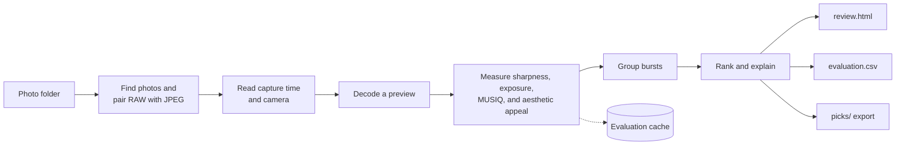

# Photo Cull

Photo Cull helps you pick the best photos from a large shoot. It groups each burst of
near-identical frames, scores every photo for sharpness, exposure, technical quality, and
visual appeal, keeps the best frame of each burst, and copies the photos you choose into a
separate folder. Everything runs on your own computer.

**Your originals are never touched.** Photo Cull does not delete, move, rename, or write to
any source file. Optional star ratings go only into the exported copies.

> **Non-commercial use only.** Photo Cull's code is MIT, but it depends on `pyiqa` and the
> MUSIQ model weights, which are licensed for non-commercial use. Do not use Photo Cull in
> paid or commercial work unless you replace those components. See
> [Models and licenses](#models-and-licenses).

This guide covers everyday use. For every option, rule, and output column, see the
[reference](docs/reference.md). For the reasoning behind each step, read
[How a Photograph Is Judged](docs/how-a-photograph-is-judged.md).

## Contents

- [Features](#features)
- [How it works](#how-it-works)
- [Quick start](#quick-start)
- [Everyday tasks](#everyday-tasks)
- [How photos are chosen](#how-photos-are-chosen)
- [What a run produces](#what-a-run-produces)
- [Improve the ranking with your decisions](#improve-the-ranking-with-your-decisions)
- [Stop and resume](#stop-and-resume)
- [Troubleshooting](#troubleshooting)
- [Privacy](#privacy)
- [Models and licenses](#models-and-licenses)
- [Project status](#project-status)
- [Contributing](#contributing)
- [License](#license)
- [More documentation](#more-documentation)

## Features

- **Groups bursts** by capture time, camera, and visual similarity, and keeps the best frame
  of each.
- **Scores every photo** for sharpness, exposure, technical quality (MUSIQ), and visual appeal
  (an aesthetic model built on CLIP).
- **Explains every score** in plain words, in the terminal and in `evaluation.csv`.
- **Reads RAW and standard files:** 18 RAW formats, including ARW, CR3, NEF, DNG, and RAF,
  plus JPEG, PNG, TIFF, WebP, and BMP.
- **Exports whole families:** a pick brings its RAW file, matching JPEG, and sidecars, and an
  export never overwrites anything.
- **Learns from your decisions:** a review page for marking keeps and rejects, feedback that
  forces or blocks picks, and a validator that measures how well the ranking matches you.
- **Reruns fast:** an evaluation cache lets you resume after Ctrl+C, change burst settings, or
  compare presets without scoring every photo again.
- **Uses your hardware:** Apple silicon (MPS), NVIDIA (CUDA), or the CPU alone.

## How it works

Evaluation decodes each photo once, from its embedded preview when it's a RAW file. The
scores are cached, so later runs only rank and regroup. [How photos are chosen](#how-photos-are-chosen)
explains the scoring.

## Quick start

### 1. Install

You need macOS 13 or later on Apple silicon, or Windows 10 or 11 with an NVIDIA GPU. Both
also work on the CPU alone, just more slowly. See
[System requirements](docs/reference.md#system-requirements) for details.

1. Install [`uv`](https://docs.astral.sh/uv/). It manages Python 3.12 and every dependency.
2. Clone this repository and install the locked environment:

   ~~~text
   git clone https://github.com/gsanders300/PicCuller.git
   cd PicCuller
   uv sync --locked
   ~~~

3. Optional but recommended: install [ExifTool](https://exiftool.org/) and make sure the
   `exiftool` command is on your `PATH`. On macOS with Homebrew, run `brew install exiftool`.
   On Windows, download the Windows executable, rename `exiftool(-k).exe` to
   `exiftool.exe`, and put its folder on your `PATH`. ExifTool reads RAW capture times and
   camera details more reliably, which makes burst grouping more accurate.

The first run needs an internet connection to download about 1.8 GB of scoring models. Later
runs work offline.

### 2. Run it on a folder

~~~text
uv run photo-cull /path/to/photos
~~~

On Windows, give a Windows path, such as `uv run photo-cull C:\Users\you\Pictures\Shoot`.

Photo Cull scans the folder and its subfolders, evaluates each photo, and groups bursts.
Then it shows the best burst winners, each with a plain-language reason:

~~~text
                                 Top Burst Winners
┏━━━┳━━━━━━━━━━━━━━━━━━━━━━┳━━━━━━━┳━━━━━━━━━━━━━━━━━━━━━━━━━━━━━━━━━━━━━━━━━━━━━━━┓
┃ # ┃ Photo                ┃ Score ┃ Why                                           ┃
┡━━━╇━━━━━━━━━━━━━━━━━━━━━━╇━━━━━━━╇━━━━━━━━━━━━━━━━━━━━━━━━━━━━━━━━━━━━━━━━━━━━━━━┩
│ 1 │ day-two/DSC_4470.NEF │  4.73 │ best of 9 in burst; next best DSC_4471.NEF    │
│   │                      │       │ scored 3% lower, mainly on sharpness;         │
│   │                      │       │ aesthetic in top 5% of all photos             │
├───┼──────────────────────┼───────┼───────────────────────────────────────────────┤
│ 2 │ day-one/DSC_4012.NEF │  4.41 │ single shot                                   │
└───┴──────────────────────┴───────┴───────────────────────────────────────────────┘
Showing 2 of 2 burst winners (the best frame of each burst) from 10 photos.
Score = aesthetic score multiplied by sharpness, technical-quality, exposure, and
preset factors (each 0 to 1). evaluation.csv explains every photo, including frames
that lost their burst.
~~~

This example is illustrative; your names, scores, and reasons will differ.

### 3. Choose how many to export

Photo Cull then asks:

~~~text
How many photos to export, best first? (1-2, 'all', or Enter for none):
~~~

- Press **Enter** to export nothing. The reports are still written, so you can look first
  and export later.
- Type a **number** to export that many burst winners, best first.
- Type **all** to export every burst winner.

After an export, an `Exported Photos` table lists each photo and why it was chosen. The run
ends by listing where everything went.

### 4. Find your picks

Everything goes into a new run folder inside your photo folder:

~~~text
/path/to/photos/.photo-cull/run_YYYYMMDD_HHMMSS_microseconds/
~~~

Your exported photos are in its `picks/` folder, with the same subfolder layout as your
source. Each pick brings its whole family along: the RAW file, a matching JPEG, and sidecar
files such as `.xmp`.

## Everyday tasks

Replace `/photos` with your folder. Run `uv run photo-cull --help` to see every option and
its default.

**Rank without exporting anything:**

~~~text
uv run photo-cull /photos --select none
~~~

All reports are still written.

**Export a fixed number without the prompt** (for scripts and logs):

~~~text
uv run photo-cull /photos --select 30 --plain
~~~

**Skip the review page** if you don't use a browser. This also skips making thumbnails:

~~~text
uv run photo-cull /photos --contact-sheet 0
~~~

**Wildlife,** preferring variety and writing star ratings:

~~~text
uv run photo-cull /photos --preset wildlife --diversity 0.25 --select 40 --write-xmp
~~~

**Portraits,** which adds face and eye checks. Their warnings are advisory:

~~~text
uv run photo-cull /portraits --preset portrait
~~~

**Compare presets** on a folder you've already run. Photo Cull reuses the stored
evaluations, so this is fast (except for `portrait`, which needs the pixels again):

~~~text
uv run photo-cull /photos --preset landscape --select none
~~~

**Merge bursts that were split,** when near-identical frames show up as separate winners:

~~~text
uv run photo-cull /photos --burst-window 5 --max-burst-duration 30 --sim-threshold 0.82
~~~

Burst settings don't affect the cache, so this rerun doesn't evaluate anything again.

**Keep near-duplicates out of the export,** for similar photos taken minutes apart that were
never one burst:

~~~text
uv run photo-cull /photos --diversity 0.25 --select 40
~~~

**Use your earlier decisions:**

~~~text
uv run photo-cull /photos --feedback /path/to/feedback.csv --select 25
~~~

**Evaluate every RAW and JPEG file separately,** instead of one file per family:

~~~text
uv run photo-cull /photos --primary all
~~~

**Turn off burst grouping,** so every photo stands alone. Sharpness compared with the whole
run still affects the score:

~~~text
uv run photo-cull /photos --no-group --select 20
~~~

**Use only the CPU:**

~~~text
uv run photo-cull /photos --device cpu --plain --select none
~~~

**Evaluate everything again from scratch:**

~~~text
uv run photo-cull /photos --refresh-cache --select none
~~~

## How photos are chosen

Photo Cull decides in four stages. The [reference](docs/reference.md#scores) has the exact
formulas and thresholds.

**1. Group bursts.** Photos join a burst when they come from the same camera, each frame is
taken within 2 seconds of the one before, the whole burst lasts no more than 10 seconds, and
neighboring frames look alike (by pixel fingerprint or by CLIP image similarity). The
`--burst-window`, `--max-burst-duration`, `--phash-threshold`, and `--sim-threshold` options
change these limits.

**2. Score each photo.** The score starts from an **aesthetic score** of roughly 1 to 10,
from a model trained on human ratings of visual appeal. It is then multiplied by factors
between 0 and 1:

- **Sharpness compared with the whole run:** with the default preset, the blurriest photos
  lose up to about 30 percent of their score.
- **Sharpness compared with the rest of the burst:** with the default preset, a frame half
  as sharp as the burst's sharpest loses about two thirds of its score.
- **Technical quality** from the MUSIQ model, which predicts how people rate problems such
  as noise, blur, and compression artifacts.
- **Exposure:** a penalty when more than 2 percent of pixels are blown out or more than
  5 percent are crushed to black.
- **Preset checks:** closed or hidden eyes (portrait) and whether the subject is framed well
  (wildlife, portrait, landscape).

**3. Pick burst winners.** The highest score in each burst wins. Only winners appear in the
table and in the default export.

**4. Build the export.** Your count takes that many winners in score order. Feedback then
applies: photos you marked `keep` are always exported and count toward your number, and
photos you marked `reject` never are. With `--diversity`, a lower-ranked winner can replace
one that looks too much like a photo already chosen.

### Presets

| Preset | Use it for | What changes |
| --- | --- | --- |
| `balanced` | General shooting (default) | Standard weights. |
| `wildlife` | Animals and action | Harsher on soft frames, both within the burst and across the run; a little more forgiving of exposure; checks the animal is fully in frame. |
| `portrait` | People | Penalizes likely closed or hidden eyes; checks for a clear face. |
| `landscape` | Scenery | More weight on overall sharpness, exposure, and technical quality; gentler within bursts; checks composition. |

### Read the reasons

The **Why** column explains each result, and `evaluation.csv` has the same reason for every
photo, including frames that lost their burst:

~~~text
3rd of 9 in burst; scored 40% lower than DSC_4470.NEF, mainly on sharpness
~~~

A reason can say how the photo did in its burst, where it stands among all photos (only when
in the top or bottom quarter), and any penalty of 5 percent or more.

Keep two limits in mind. Most weights are informed guesses. Only the `balanced` preset's
weight for sharpness compared with the whole run has been tuned, against one shoot's
keep-and-reject decisions. And sharpness is judged against the other photos in the same run,
so the same photo can score differently in a different folder.

## What a run produces

Each run folder contains:

| File | What it's for |
| --- | --- |
| `picks/` | Your exported photos with their families. Present only when you export something. |
| `evaluation.csv` | Every photo's scores, ranks, burst, reason, and each score factor. Open it in a spreadsheet to see why anything ranked where it did. |
| `review.html` | A thumbnail page for a web browser that shows each burst whole, where you can mark keeps and rejects. |
| `feedback.csv` | A decision template listing every photo, with the current selection marked `keep`. |
| `failures.csv` | Any photo that couldn't be read or scored, and why. Empty when all went well. |
| `run.json` | A full audit of the run: settings, model versions, counts, and timings. |
| `export_manifest.csv` | Every file copied into `picks/`, with sizes. |

The output folder also keeps an evaluation cache and a shared thumbnail store, so repeat runs
on the same photos are fast. See [Output files](docs/reference.md#output-files) for every
column.

## Improve the ranking with your decisions

The scores are a starting point. Your decisions make them better, both for this shoot and
for tuning the tool.

### Mark keeps and rejects

A feedback file is a CSV with a path and a decision:

~~~csv
file_path,decision
/absolute/path/IMG_0001.ARW,keep
/absolute/path/IMG_0002.ARW,reject
relative/path/IMG_0003.ARW,keep
~~~

The easiest start is the run's own `feedback.csv`. It lists every photo, with the current
selection already marked `keep`, so change or add decisions and save it. You can also mark photos in `review.html` and select
`Download feedback.csv`. Select a photo on the page to see it full screen, and click it to
zoom in on detail such as focus. Then rerun with `--feedback path/to/feedback.csv`.

The page shows each burst whole. The frame Photo Cull chose is labelled `Pick` and the
frames it beat are labelled `Lost`. If it chose the wrong frame, reject the `Pick` and keep
the frame you prefer. That pair is the most useful decision you can record. The page shows
up to `--contact-sheet` photos (100 by default), so raise it to see more bursts.

- `keep` always exports the photo, even one that lost its burst.
- `reject` never exports it.
- Relative paths start from your photo folder. Decisions ignore letter case, and extra
  columns are ignored.

[Feedback files](docs/reference.md#feedback-files) in the reference lists every rule.

### Check how well the ranking matches you

Once you've marked a representative set with both keeps and rejects, compare them with a
run's scores:

~~~text
uv run photo-cull-validate .photo-cull/run_.../evaluation.csv /path/to/feedback.csv
~~~

It reports how often your keeps rank above your rejects, among other measures. See
[Validate the ranking](docs/reference.md#validate-the-ranking). Several sessions of labeled
decisions are the one thing that would let the preset weights be tuned properly.

## Stop and resume

Press **Ctrl+C** to stop at any time. Every photo already evaluated is saved, so running the
same command again picks up where it left off. The metrics file is written before the export
question, so stopping at the prompt loses nothing either.

Photo Cull exits with code 0 on success, 1 when the run fails, 2 for a bad option or path,
and 130 when you stop it. See
[Interruption, recovery, and exit codes](docs/reference.md#interruption-recovery-and-exit-codes).

## Troubleshooting

**Similar photos show up as separate winners.** Open `evaluation.csv` and compare their
`timestamp` values. If they are seconds apart, the burst was split: loosen `--burst-window`,
`--max-burst-duration`, or `--sim-threshold`. If they are minutes apart, they were never one
burst: use `--diversity 0.25` to keep look-alikes out of the export. If `camera_serial`
differs, a second camera's frames broke the burst. If `timestamp_source` is
`filesystem_mtime`, capture times weren't read from the photo; install ExifTool.

**No images are found.** Check that the path is a folder, the file extensions are supported,
the files aren't symbolic links, and they aren't inside a `.photo-cull` output folder. A
folder with no supported images exits with code 0 and creates no run folder. See
[Supported files](docs/reference.md#supported-files).

**ExifTool isn't available.** Install it and put it on `PATH`, or use
`--metadata-backend pillow`. Pillow reads standard EXIF and some RAW preview EXIF, and falls
back to the file's modification time when there is none.

**A warning says photos have no readable capture time.** Photo Cull used those files'
modified times, which can put them in the wrong bursts. Install ExifTool, which reads capture
times from more formats, and run again.

**A warning says no feedback decisions match.** The paths in your feedback file don't point
into the folder you ran on. This happens when you mark photos on another computer or move the
collection. Edit the paths, or run on the folder the file was made for.

**Capture times are in the wrong zone.** Tell Photo Cull the zone the camera was set to. This
changes only timestamps that don't already include an offset:

~~~text
uv run photo-cull /photos --assume-timezone America/New_York
~~~

**CUDA or MPS isn't available.** Use `--device auto` or `--device cpu`. An explicit `cuda` or
`mps` requires that device to be available when the models load.

**The GPU runs out of memory.** Lower the batch size with `--batch-size 2`. Photo Cull also
splits a failing batch automatically and can fall back to the CPU.

**A model checksum doesn't match.** Remove the one file named in the error and run again to
download a verified copy. Don't delete the whole model cache unless you want to download
every model again.

**A RAW file fails.** Read its row in `failures.csv`. The bundled LibRaw may not support that
camera or RAW variant yet. Update the locked dependencies only in a tested development
branch.

**Nothing is exported.** Without a terminal, Photo Cull asks nothing and exports nothing
unless you pass `--select`. Also check your feedback file for `reject` decisions.

**The review page forgot my decisions.** The browser saves them for each run, but only in
that browser on that computer, and not at all if it blocks local storage. Select
`Download feedback.csv` when you finish, because Photo Cull reads only that file.

**A spreadsheet mangles the CSV.** Import it as UTF-8 and keep path columns as text. Photo
Cull already protects cells that a spreadsheet could run as formulas.

**The ranking disagrees with you.**

1. Read `score_reason` and the `*_multiplier` columns in `evaluation.csv` to see which factor
   moved each photo.
2. Mark representative photos `keep` and `reject`.
3. Run `photo-cull-validate`.
4. Compare all four presets.
5. Change `--diversity` in small steps.
6. Keep the original reports for comparison.

One small collection isn't enough to judge the tool.

## Privacy

Photo Cull runs on your computer. Your photos never leave it, and Photo Cull collects no
usage data. It needs the network only to download the pinned models on the first scored run.

The models come from Hugging Face and GitHub at fixed revisions, and Photo Cull checks the
MUSIQ and aesthetic weights against fixed SHA-256 values. Reports, exports, and the cache go in
the output folder, which is `.photo-cull` inside your photo folder unless you choose
another. Downloaded models go in your user cache folder. See
[Privacy and model integrity](docs/reference.md#privacy-and-model-integrity).

## Models and licenses

| Component | Source | License |
| --- | --- | --- |
| CLIP ViT-L/14 image model | [OpenAI](https://github.com/openai/CLIP), through [Hugging Face](https://huggingface.co/openai/clip-vit-large-patch14) | MIT for the code; see the model card for intended use |
| Aesthetic head | [LAION improved aesthetic predictor](https://github.com/christophschuhmann/improved-aesthetic-predictor) | Apache-2.0 |
| MUSIQ technical quality, KonIQ weights | [IQA-PyTorch (`pyiqa`)](https://github.com/chaofengc/IQA-PyTorch) | CC BY-NC-SA 4.0 |

Photo Cull's own code is under the MIT license. Three components carry extra terms:

- **`pyiqa` 0.1.15** is licensed under PolyForm Noncommercial 1.0.0.
- **MUSIQ (KonIQ) weights** are licensed under CC BY-NC-SA 4.0. Photo Cull downloads them
  on first run from the IQA-PyTorch weights repository. They are not included in this repo.
- **CLIP ViT-L/14** is MIT for the code. OpenAI's model card limits intended use to
  research, so read it before any deployment.

While Photo Cull depends on `pyiqa` and the MUSIQ weights, treat the tool as a whole as
non-commercial. These terms apply to whoever installs and runs those components. They do
not change the license on Photo Cull's source files.

## Project status

Version 1.0 is the first stable release. Continuous integration tests it on macOS and
Windows, but these areas aren't fully validated yet:

- representative sessions on Apple silicon (MPS) and on Windows with CUDA
- camera-specific autofocus-point mapping
- XMP rating round trips in photo applications
- preset weights against a large set of keep-and-reject decisions
- MUSIQ throughput in real sessions

[PotentialEnhancements.md](PotentialEnhancements.md) lists known gaps and possible future
work.

## Contributing

Pull requests are welcome. Set up the development environment and run the checks:

~~~text
uv sync --locked --group dev
uv run pytest -q
uv run ruff check .
~~~

Read [docs/development.md](docs/development.md) for the code layout and
[AGENTS.md](AGENTS.md) for the rules every change must keep. The most important is that
source photos are read-only: no change may delete, move, rename, or modify them.

## License

Photo Cull's source code is released under the [MIT license](LICENSE). Its dependencies
and downloaded models have their own licenses, and some limit use to non-commercial
purposes. See [Models and licenses](#models-and-licenses) and
[THIRD-PARTY-NOTICES.md](THIRD-PARTY-NOTICES.md).

## More documentation

| Document | Contents |
| --- | --- |
| [docs/reference.md](docs/reference.md) | Every option, scoring rule, output column, cache behavior, exit code, safety protection, and known limitation. |
| [docs/how-a-photograph-is-judged.md](docs/how-a-photograph-is-judged.md) | One photograph's journey through every step, with the reasoning. |
| [docs/development.md](docs/development.md) | Setting up, testing, dependencies, and the code layout. |
| [Specifications.md](Specifications.md) | The formal contract the code must meet. |
| [PotentialEnhancements.md](PotentialEnhancements.md) | Known gaps and possible future work. |
